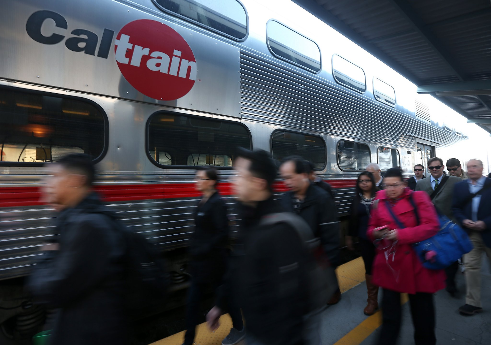

# CalTrain (Synchronization and Mutual Exclusion)

## 1. Objectives

* To get familiar with concurrent programming.
* To better understand handling races, synchronization, mutex, and condition variables.
* To learn about debugging concurrent programs.

## 2. Problem Statement

CalTrain (the train running in California, USA) has decided to improve its efficiency by automating not just its trains but also its passengers. From now on, passengers will be robots. Each robot and each train is controlled by a thread. You have been hired to write synchronization functions that will guarantee orderly loading of trains. You must define a structure struct station, plus several functions described below.

1. When a train arrives in the station and has opened its doors, it invokes the function: **station_load_train(struct station * station, int count)** where count indicates how many seats are available on the train. The function must not return until the train is satisfactorily loaded (all passengers are in their seats, and either the train is full or all waiting passengers have boarded). Note, that the train must leave the station promptly if no passengers are waiting at the station or it has no available free seats.

2. When a passenger robot arrives in a station, it first invokes the function: **station_wait_for_train(struct station * station)** This function must not return until a train is in the station (i.e., a call to station load train is in progress) and there are enough free seats on the train for this passenger to sit down. Once this function returns, the passenger robot will move the passenger on board the train and into a seat (you do not need to worry about how this mechanism works).

3. Once the passenger is seated, it will call the function: **station_on_board(struct station * station)** to let the train know that it’s on board.

## 5. Helpful Resources

What are race conditions?:
https://youtu.be/FY9livorrJI

What is Mutex?:
https://youtu.be/oq29KUy29iQ

Condition variable:
https://youtu.be/0sVGnxg6Z3k?feature=shared

Signalling for condition variables:
https://youtu.be/RtTlIvnBw10?feature=shared
